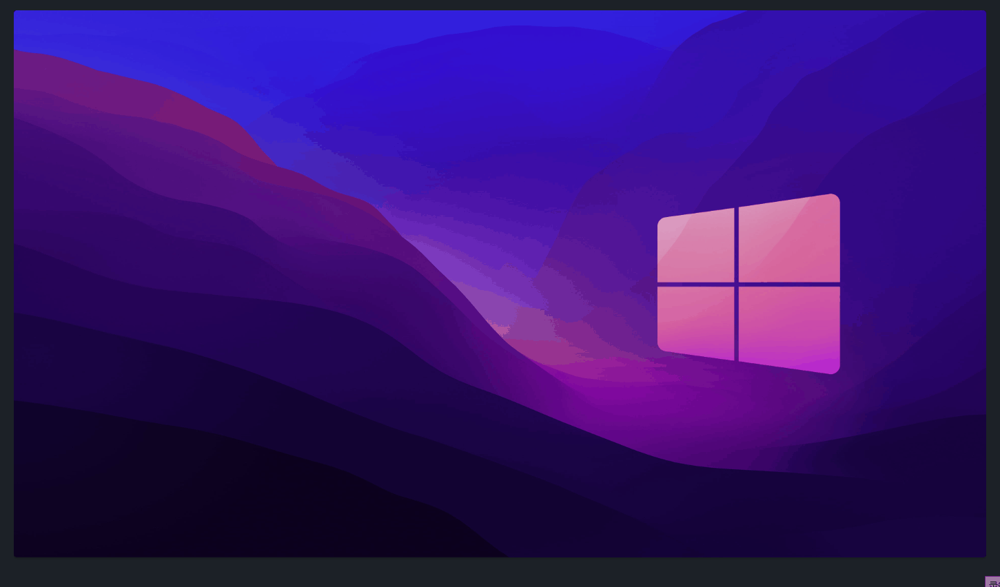
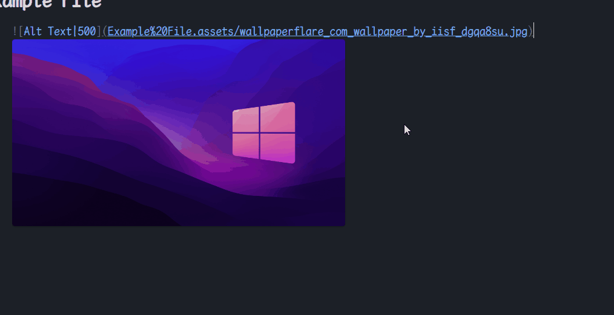
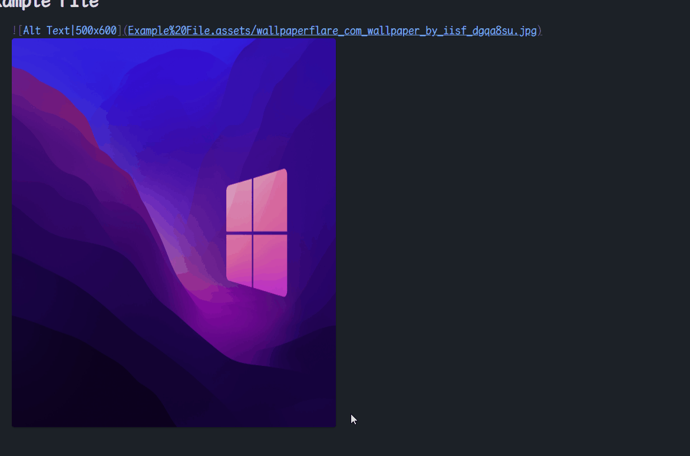
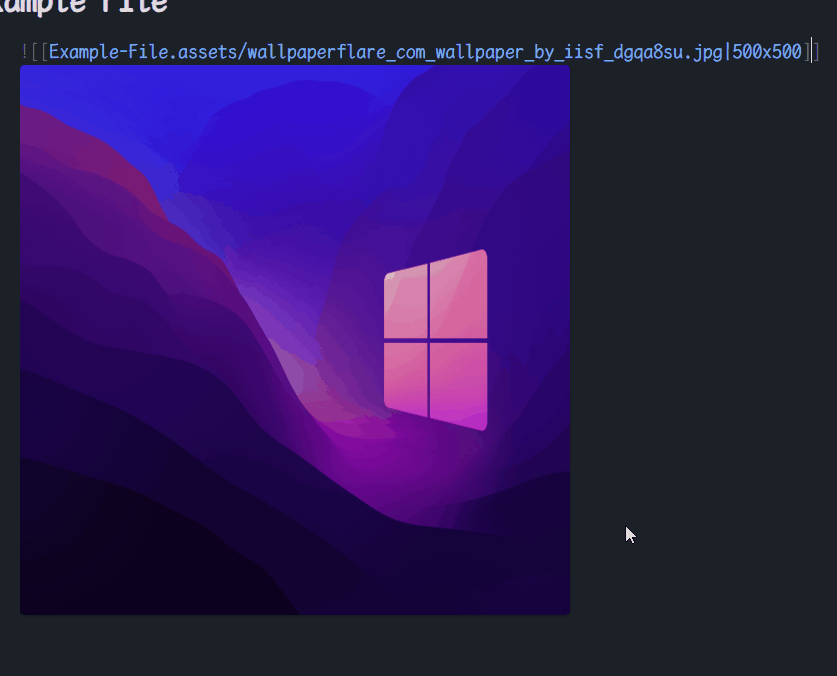

# Obsidian Image Scaler

This plugin allows you to scale images by dragging the edge of the image with your mouse. When dragging, the original image link format will be converted to the universal `` tag format.

## Eamples

` -> `

` -> `

` -> `

`![[Image.jpg|WxH]] -> `

